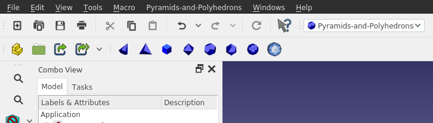

# Pyramids-and-polygons
FreeCad Workbench / Macros for building pyramids 
and polygons:
- tetrahedron
- hexahedron
- octahedron
- dodecahedron
- icosahedron
- truncated icosahedron (football)
- geodesic spheres (level 1 to 10)

# 2 versions
 - the first edition are macros. (the resulting parts are fully scalable)
 - the second edition is a workbench with fully scalable parts just like in the part workbench

They can be installed using the addon manager in FreeCadMenu/Tools/Addon Manager
- Select the tab Macros or Workbenches 
- Select and click "Install"

# How to install the workbench manually
- Find the Macro folder via FreeCadMenu/Edit/Preferences/Macro ...
- Go to the 'Mod' folder, next to the 'Macro' folder
- download a copy of this repository and put it in the Mod folder
- Rename the folder to "Pyramids-and-Polygons" (remove "-master")
- (re)start FreeCAD
- The workbench 'polyhydrons' is now in the list, select it
- click on an icon, and proceed just like in the Part workbench.

